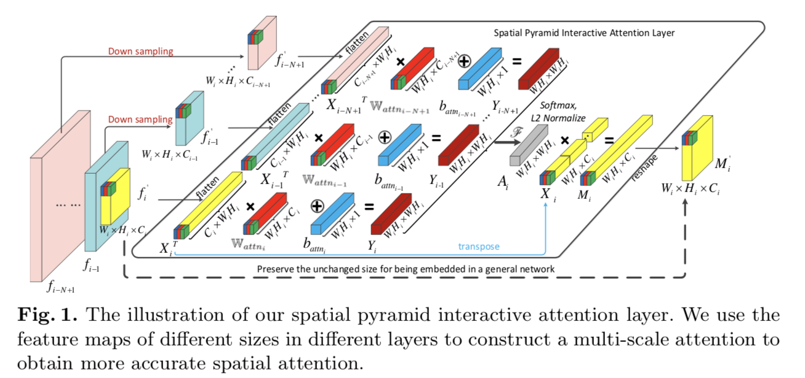

## Interaction-aware Spatio-temporal Pyramid Attention Networks for Action Classification

本文的特点是利用了卷积网络的多尺度特征，借鉴PCA的思想，学习了feature map的attention map。

通过利用多尺度的特征，对前几层的每个尺度的特征求出一个attention map，要求这些attention mapyou很好的diversity。之后将这些attention map结合起来作为当前层的attention map，实现了non-local 交互，让feature map的每一个位置的特征能够包含更多位置的信息。这个attention layer可以结合到任何CNN架构中。