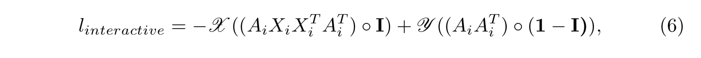
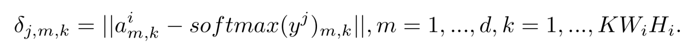
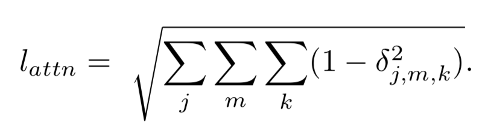
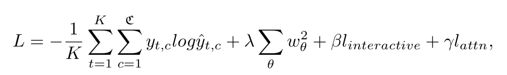

## Interaction-aware Spatio-temporal Pyramid Attention Networks for Action Classification

本文的特点是利用了卷积网络的多尺度特征，借鉴PCA的思想，学习了feature map的attention map。输入可以为任意帧的堆叠，所以可以拓展到spatio-temporal上。

CNN的feature map为W * H * C，flatten 到 WH*C，用一个W和b对其进行线性变换到Y，此时就相当于进行了PCA操作。Y的维度为WH *  WH，表示当前尺度的attention map。对当前尺度的前几个尺度的feature map降采样后进行同样的操作，得到多个尺度的Y，之后将这些attention map进行融合后得到A，即当前尺度最终的feature map。在损失函数中对不同尺度求出来的Y要求了diversity。由于W和b的维度只与对应层的feature map维度有关，所以在时间上可以将一系列帧一起输入网络，提取出时空信息。

#### Loss Function

interaction loss是仿照PCA设计的。

花写X与Y分别表示sum和quadratic sum operator。

下面的损失函数就是为了保证每一个尺度的attention有diversity。

