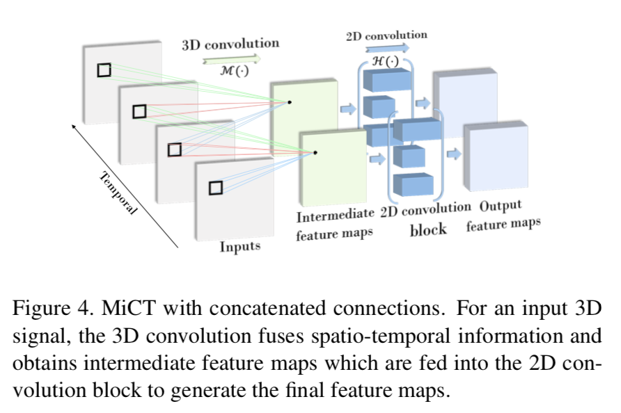
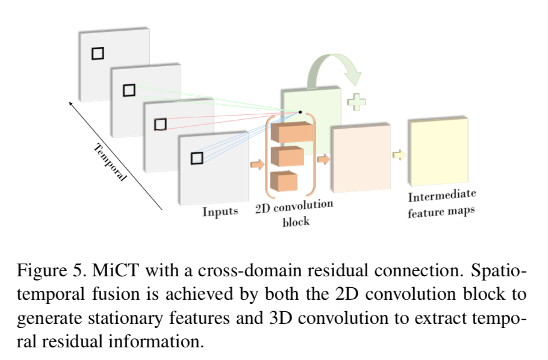
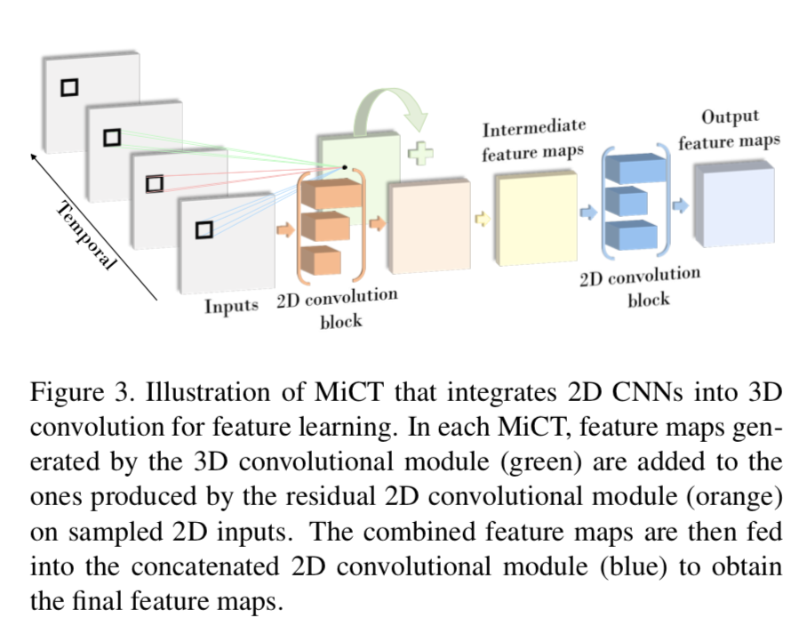

### MiCT: Mixed 3D/2D Convolutional Tube for Human Action Recognition

这篇文章的主要工作就是将3D CNN与2D CNN结合，通过concat和residual连接，减少3D block的同时增加了网络的深度，相比传统的3D CNN，在减少了训练复杂度的情况下提升了精度。

#### Concat connection

如下图所示，在每个3D卷积层后接一个2D卷积层，2D卷积层的输入为3D卷积层的输出，2D卷积层的输出作为下一个3D卷积层的输入。这样就增加了网络的深度。

#### Residual connection

假设3D卷积层的输出为N* T * H * W，则对这一层的输入采样T帧，经过2D卷积后与3D卷积输出对应相加。 

#### MiCT block

串接层通过2D CNN增加了网络的深度，代替了3D CNN，降低了计算复杂度。由于相近的帧有信息冗余，所以在residual连接时采样T帧输入到2D CNN即可，由于2D CNN已经学到了空间特征，所以3D CNN只需要学习补足的时间特征即可，降低了计算复杂度。

#### Keypoint：

借鉴了Resnet的架构，用2D block代替了部分3D block，在减少了计算复杂度的同时提升了精度。

