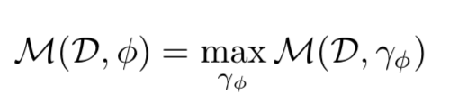
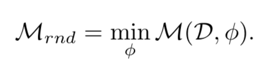
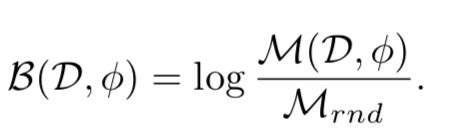
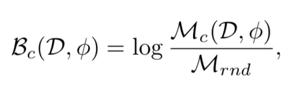
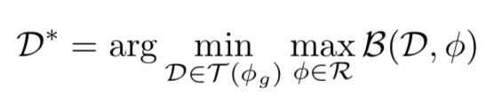
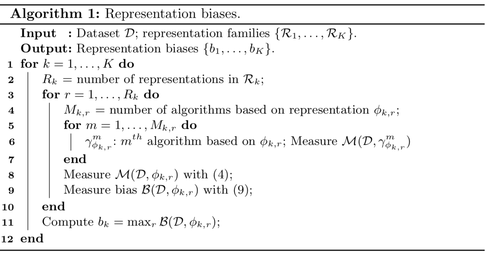

#### RESOUND: Towards Action Recognition without Representation Bias

这篇文章主要是提出了如何解决动作识别数据集偏差的问题。

许多数据集中用静态信息就能取得很好的效果，这就是有了静态偏差。如下是三种静态偏差：

- object bias：例如“play piano”在ActivitNet与UCF101中是唯一一个类别涉及到钢琴的，那么识别出钢琴就能进行动作分类。

- scene bias：basketball dunk和soccer juggling有不同的时间特征，然而只用通过背景就行进行分类。
- person bias：brushing hair有很多脸部特写，military marching通常包含一大群穿着军事制服的人

总体来说有两类bias

- Dataset Bias

  与算法相关，在A数据集上效果好但是在B上差，可以通过评价算法的bias和var得出

- Representation Bias

  与数据集相关。例如一个数据集是抛硬币，如果硬币重量不均匀，那么数据集就是有偏的

定义：

Representation: a mathematical characterization of some property of the visual work。例如光流就是一种representation。

下面是representation $\phi$在数据集上的性能的定义，$\gamma_\phi$表示使用这种representation的一种算法。

下面是chance-level-performance，例如分类任务中的随机分类

数据集对representation的bias以及class level的bias则表示为

那么目的就是设计一个对representation family Ryou最小的偏差的数据集

有两种实现RESOUND的方式

1. 以一个数据集D为起点，添加或删除来进行优化
2. 找到对representation family R最无偏的类别来设计。例如不能仅仅通过判断背景就能把object进行分类。