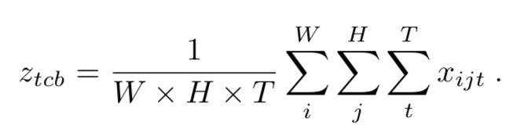
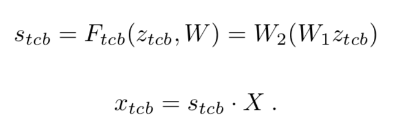
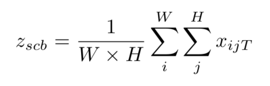
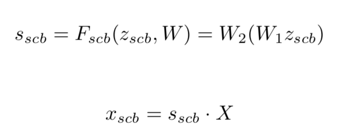
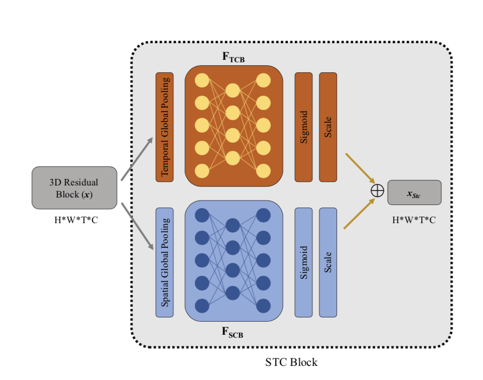
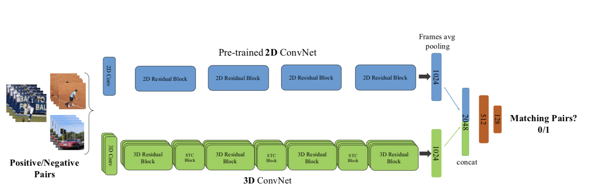

### Spatio-Temporal Channel Correlation Networks for Action Classification

这篇文章主要是提出了一种利用时空特征中channel correlation来训练3D CNN的方式，以及用2D CNN来辅助3D CNN训练的方式。

#### STC（spatio-temporal channel correlation）block

由两个branch组成：SCB（spatial correlation branch）和TCB（temporal correlation branch）

目的是学习在时空特征上的inter channels correlations的信息。

TCB：

X是3D卷积的输出feature-map，维度是H x W x T x C 。在这个brance对spatial和temporal进行pooling来抽取channel特征，之后进行两层FC变换。W1的维度是C/r x C, W2的维度是C x C/r， 最后用s对X进行缩放。 

SCB：

与TCB类似，但是只对channel-wise的信息进行压缩。这一个branch考虑了temporal-channel信息。W1的维度是(T * C)/r x (T * C), W2维度是 C x (T*C)/r

最后的$x_{stc} = avg(x_{tcb}, x_{scb})$

#### Transfer learning

这个迁移学习是完全无监督的，从同一个视频的时间戳提取出来的两个pairs是正样本，属于不同视频的是负样本。在训练时把2D CNN的参数冻结，2D CNN的结果是对X帧进行一个pooling得到。

思考：

TCB与SCB就是简单的对特征进行pooling，之后用两个FC层来学习channel-wise的联系，相当于学习了channel-wise的attention之后对X进行缩放，但是在提取channel feature时没有考虑到对spatial和temporal的attention。