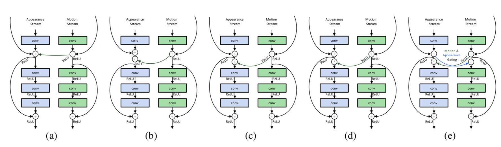
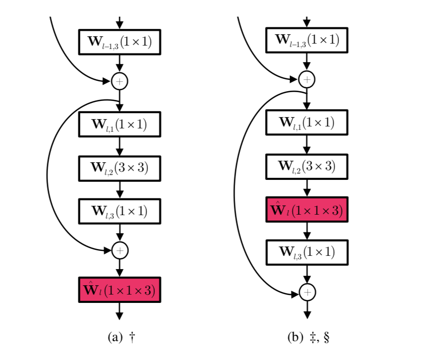

## Spatiotemporal Multiplier Networks for Video Action Recognition

这篇文章主要是探讨了2-stream方式的空间特征和时间特征的融合方式。一个stream是2D CNN作用到RGB图像上，一个stream是光流特征。在两个stream之间加入了一些连接达到了交互的效果。由于每个光流片段的范围太小，所以之后还利用了1D temporal 卷积，学习了global temporal 特征，W作为temporal filter,初始化为identity matrix，可以加在任何地方。

总结：

这篇文章探索了两个stream特征在中间层的交互方式。但是他的连接方式是同步的，训练时要两个stream一起训练，增加了训练复杂度，而且同层连接可能不太合适，appearance stream与temporal stream可能是不同层的特征才有很好的对应关系。

不太理解1维卷积中加上W作为temporal filter的作用。