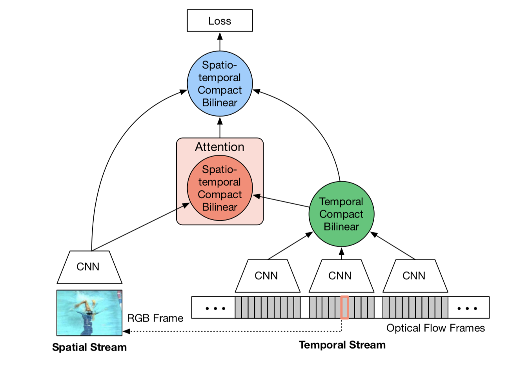

## Spatiotemporal Pyramid Network for Video Action Recognition

本文探讨了一种空间特征与时间特征融合的方法。框架如下。

特征融合一般有加法，乘法，串接，bilinear操作，由于前面三种不能很好地捕捉到空间特征与时间特征的交互信息，所以就用了bilinear操作，同时也解决了特征维度的问题。

STCB算法实现了一种特征融合的方式：z=vec(outer_dot(x,y))。x，y是两个待融合的特征，可以是空间特征，也可以是时间特征，进行外积后进行一次Count Sketches映射，将矩阵降到了低维空间，同时该映射也可以避免直接计算外积。由于Count Sketches映射可以表示为卷积形式，两个向量外积的CK映射可以表示为分别进行CK映射后进行卷积，卷积也可以通过FFT进行快速计算，就有了如下特征融合的算法。

#### Temporal fusion

由于一个光流只有十帧，为了学习到global temporal特征，就用了多个共享参数的CNN来对更大范围的光流采样提取特征，之后通过STCB进行特征融合。如果对多个RGB帧也提取特征的话，可能会造成overfitting，所以支队刚大范围的光流进行融合。

#### Spatiotemporal Attention

该attention模块的主要作用是利用motion信息定位图像特征的重要区域。由于CNN的底层都是关于edge，corner，texture的特征，而高层才能提取到class-specific特征，所以模块的位置是接在最后一个卷积层后面，代替原先的average pooling，进行weighted pooling。在BN-Inception中将1048 * 7 * 7的特征转化为1048 * 1 * 1维。方法是对图像 feature map的每个grid location与temporal feature进行STCB融合，之后接几个卷积层。这样就能让spatial stream捕捉到能多moving objects的特征。

#### Architecture

网络先对光流特征进行特征融合后，与spatial特征再一起计算spatiotemporal attention，计算出一个spatiltemporal feature。之后三个特征再做一次融合。得出分类结果。

